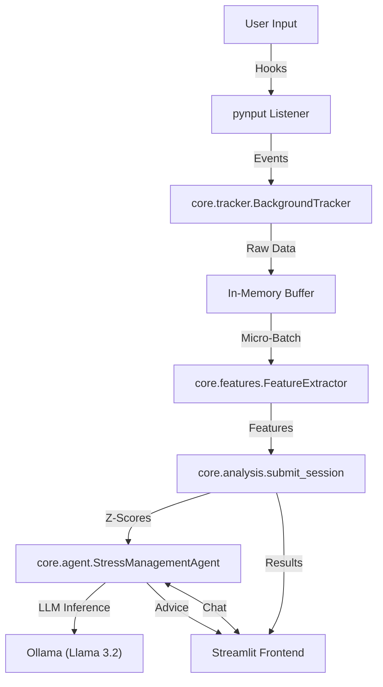

# 🧠 StressTracker AI

> **"Your digital wellbeing, monitored in real-time."**


**StressTracker AI** is a privacy-focused, local-first application that analyzes your digital biomarkers (mouse movements, keystroke dynamics) to detect stress and cognitive load in real-time.

### Dashboard Preview


### Analysis Results
| Stress Metrics | Chat with Dr. AI |
|:---:|:---:|
|  |  |


> 📘 **Technical Deep Dive**: Curious about the math? Check out the [Methodology & Signal Processing Docs](docs/index.html).


---

## ✨ Features

- **🖱️ Kinematic Analysis**: Tracks mouse jitter, path efficiency, and velocity to detect SNS (Sympathetic Nervous System) activation.
- **⌨️ Keystroke Dynamics**: Analyzes flight time variance (ISO 9241-11) as a proxy for cognitive load.
- **🤖 AI Agent**: Integrated Llama-3.2 based clinical psychiatrist persona provides actionable text-based feedback.
- **📊 Real-time Dashboard**: Beautiful "Deep Space" aesthetic UI built with Streamlit.
- **🔒 Privacy First**: All tracking happens locally on your machine. No raw input data leaves your device.

## 🛠️ Tech Stack

- **Frontend**: Streamlit (Python)
- **Backend/Logic**: Pydantic, NumPy, SciPy (Python)
- **Input Tracking**: `pynput` (System-wide hooks)
- **AI/LLM**: Llama-3.2 (via LangChain & Ollama)
- **Architecture**: Monolithic Local App

## 🚀 How to Use

### 1. Prerequisites
- Python 3.9+
- [Ollama](https://ollama.ai) installed (The script will automatically pull the model for you!)

### 2. Installation & Run (All Platforms)

Script that sets everything up for you (Virtual Environment + Dependencies + App Launch).

```bash
# 1. Clone the repository
git clone https://github.com/alwaysvivek/stress-tracker.git
cd stresstracker

# 2. Run the magic script
python start.py
```

That's it! The app will open in your browser.

---


## 🏗️ Architecture

How the pieces fit together:



---

## 🔧 Troubleshooting

### 1. "Ollama not found"
The app requires Ollama to be installed and running.
*   **Fix**: Install from [ollama.com](https://ollama.com).
*   **Verify**: Run `ollama list` in your terminal. You should see `llama3.2`.

### 2. "Input monitoring permission denied" (macOS)
macOS requires explicit permission for apps to monitor keystrokes.
*   **The Checkmark Lie**: Even if PyCharm is checked in System Settings, macOS often ignores it after an update or app restart.
*   **The Fix**:
    1.  Go to **System Settings > Privacy & Security > Input Monitoring**.
    2.  Select `PyCharm` and **click the minus (-)** button to remove it entirely.
    3.  Run the app again.
    4.  macOS will prompt you to "Open System Settings". Click it and **Grant Permission** freshly.
    5.  **Restart PyCharm** (completely quit, not just close window).
*   **The Nuclear Option** (if above fails):
    Run this in your terminal to clear the database:
    ```bash
    tccutil reset Accessibility
    ```
    Then restart your computer.

### 3. "ModuleNotFoundError"
*   **Fix**: Ensure your virtual environment is active.
    ```bash
    source .venv/bin/activate
    pip install -r requirements.txt
    ```

---

## 🌍 Why "Local Only"?

You might wonder why this isn't a hosted web app.
> [!IMPORTANT]
> **System-Wide Tracking**: To analyze real work stress, the app needs to track mouse/keyboard usage *outside* the browser window (e.g., while you use Excel, Slack, IDEs). Web browsers strictly block this for security. Therefore, this app **must run locally** on your machine to access these operating system hooks via `pynput`.

*Built with ❤️ for Digital Health*
