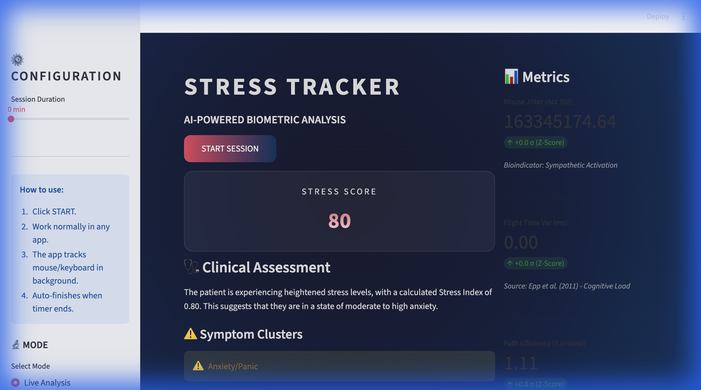
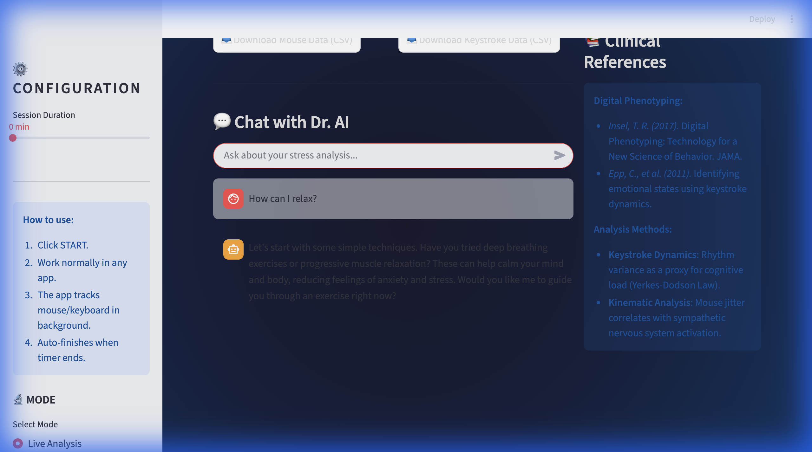
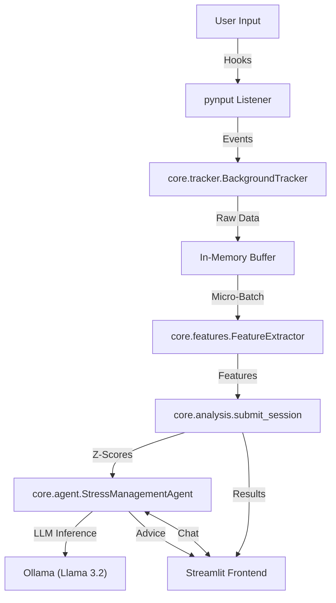

# 🧠 StressTracker AI

**Your digital wellbeing, monitored in real-time.**


**StressTracker AI** is a privacy-focused, local-first application designed to monitor digital biomarkers—such as mouse movements and keystroke dynamics—to detect stress and cognitive load in real-time. By leveraging local AI, it provides personalized insights without compromising your data privacy.

---

## ✨ Features

- **🖱️ Kinematic Analysis**: Detects Sympathetic Nervous System (SNS) activation by tracking mouse jitter, path efficiency, and velocity.
- **⌨️ Keystroke Dynamics**: Assessments cognitive load by analyzing flight time variance (ISO 9241-11).
- **🤖 Dr. AI Assistant**: A Llama-3.2 powered clinical psychiatrist persona offering actionable, text-based feedback.
- **📊 Real-time Dashboard**: An immersive "Deep Space" themed UI built with Streamlit for monitoring your status.
- **🔒 Privacy First**: Completely local processing. No raw input data ever leaves your device.

---

## 🚀 Getting Started

### Prerequisites

- **Python 3.9+**
- **[Ollama](https://ollama.ai)**: Required for the AI agent. The application will automatically pull the `llama3.2` model if needed.

### Installation & Run

We provide a startup script that handles virtual environment creation, dependencies, and launching the application.

1.  **Clone the repository**:
    ```bash
    git clone https://github.com/alwaysvivek/stress-tracker.git
    cd stresstracker
    ```

2.  **Launch the application**:
    ```bash
    python start.py
    ```

The application will automatically open in your default web browser.

---

## 📊 Dashboard Overview

### Main Interface


### Analysis & Insights
| Real-time Metrics | Dr. AI Consultation |
|:---:|:---:|
|  |  |

> 📘 **Technical details**: For a deep dive into the mathematical models and signal processing, please refer to the [Methodology & Signal Processing Documentation](docs/index.html).

---

## 🏗️ Architecture

The system operates as a monolithic local application to ensure system-wide tracking and privacy.



### Why "Local Only"?

> [!IMPORTANT]
> **System-Wide Tracking**: To accurately analyze work stress, the application must track inputs across all applications (Excel, Slack, IDEs, etc.). Web browsers restrict this access for security reasons. Thus, StressTracker AI runs locally to utilize system-level hooks via `pynput` while keeping your data secure on your machine.

---

## 🔧 Troubleshooting

### Common Issues

**1. "Ollama not found"**
- **Cause**: Ollama is not installed or running.
- **Solution**: Install from [ollama.com](https://ollama.com) and verify with `ollama list` in your terminal.

**2. "Input monitoring permission denied" (macOS)**
- **Cause**: macOS security restrictions blocking keystroke monitoring.
- **Solution**:
    1.  Navigate to **System Settings > Privacy & Security > Input Monitoring**.
    2.  Remove `PyCharm` (or your terminal/IDE) using the **minus (-)** button.
    3.  Restart the application and click **Grant Permission** when prompted.
    4.  Restart your IDE/Terminal completely.
- **Advanced Fix**: Run `tccutil reset Accessibility` in the terminal and potential restart your computer.

**3. "ModuleNotFoundError"**
- **Cause**: Dependencies not installed in the current environment.
- **Solution**:
    ```bash
    source .venv/bin/activate
    pip install -r requirements.txt
    ```

---

*Built with ❤️ for Digital Health*
